# FLASH ATTENTION-2 : Faster Attention with Better Parallelism and Work Partitioning

更快的注意力，更好的并行性和工作分区

> 该内容来源于微信公众号的介绍，这里首先依据公众号内容进行一个简单的内容整理。

来源：[史诗级提升！斯坦福博士一己之力让Attention提速9倍](https://mp.weixin.qq.com/s/qAlu9NHgrihUExbTasJr7A)

## 模型介绍与描述 - 微信公众号

继超快且省内存的注意力算法FlashAttention爆火后，升级版的2代来了。

FlashAttention-2是一种从头编写的算法，可以加快注意力并减少其内存占用，且没有任何近似值。

速度比第一代提升了2倍，相较于PyTorch的标准注意力，其运行速度最高可达9倍。

一年前，StanfordAILab博士Tri Dao发布了FlashAttention，让注意力快了2到4倍，如今，FlashAttention已经被许多企业和研究室采用，广泛应用于大多数LLM库。

如今，随着长文档查询、编写故事等新用例的需要，大语言模型的上下文以前比过去变长了许多——GPT-4的上下文长度是32k，MosaicML的MPT上下文长度是65k，Anthropic的Claude上下文长度是100k。

但是，扩大Transformer的上下文长度是一项极大的挑战，因为作为其核心的注意力层的运行时间和内存要求，是输入序列长度的二次方。

Tri Dao一直在研究FlashAttention-2，它比v1快2倍，比标准的注意力快5到9倍，在A100上已经达到了225 TFLOP/s的训练速度！

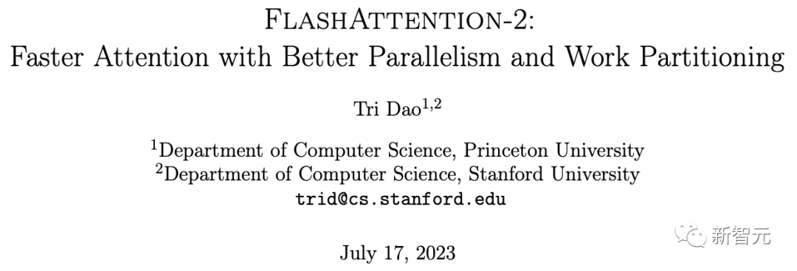

> 论文地址：https://tridao.me/publications/flash2/flash2.pdf
>
> 项目地址：https://github.com/Dao-AILab/flash-attention

### **FlashAttention-2：更好的算法、并行性和工作分区**

**端到端训练GPT模型，速度高达225 TFLOP/s**

虽说FlashAttention在发布时就已经比优化的基线快了2-4倍，但还是有相当大的进步空间。

比方说，FlashAttention仍然不如优化矩阵乘法（GEMM）运算快，仅能达到理论最大FLOPs/s的25-40%（例如，在A100 GPU上的速度可达124 TFLOPs/s）。

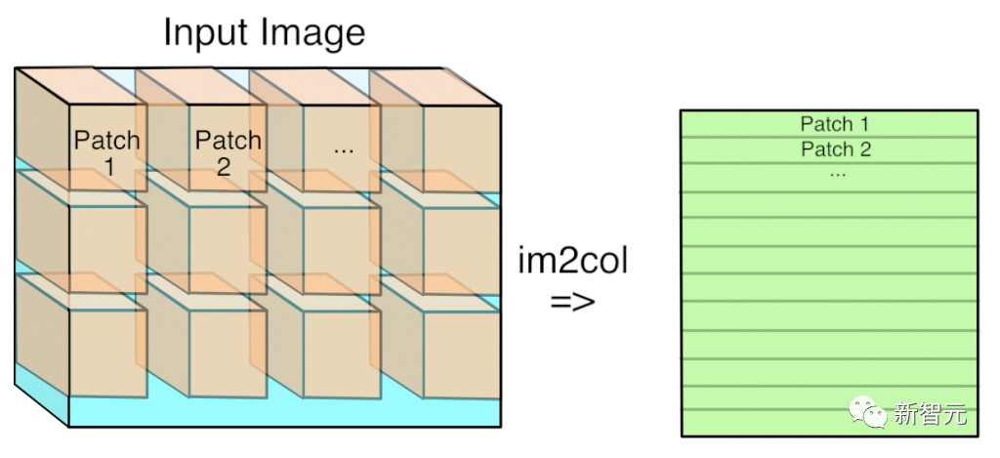

GEMM如何用于卷积

在过去的几个月里，研究人员一直在开发FlashAttention-2，它的性能指标比第一代更强。

研究人员表示，2代相当于完全从头重写，使用英伟达的CUTLASS 3.x及其核心库CuTe。从速度上看，FlashAttention-2比之前的版本快了2倍，在A100 GPU上的速度可达230 TFLOPs/s。

当使用端到端来训练GPT之类的语言模型时，研究人员的训练速度高达225 TFLOPs/s（模型的FLOP利用率为72%）。

**对注意力计算重新排序**

我们知道，FlashAttention是一种对注意力计算进行重新排序的算法，利用平铺、重新计算来显著加快计算速度，并将序列长度的内存使用量从二次减少到线性。

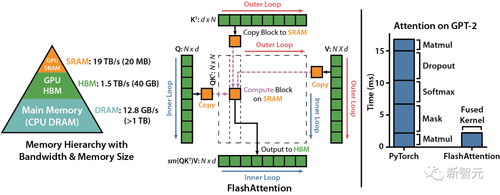

研究人员将输入块从HBM（GPU内存）加载到SRAM（快速缓存），并对该模块执行注意，更新HBM中的输出。

由于没有将大型中间注意力矩阵写入HBM，内存的读/写量也跟着减少，进而带来了2-4倍的执行时间加速。

下图是FlashAttention的前向传递图：通过平铺和softmax重新缩放，研究人员人员按模块进行操作，避免从HBM读取或是写入，同时获得正确输出，无需近似。

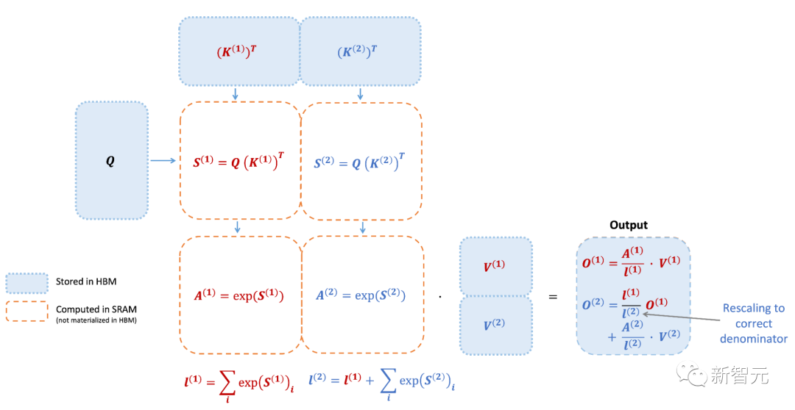

然而，FlashAttention仍然存在一些低效率的问题，这是由于不同线程块之间的工作划分并不理想，以及GPU上的warp——导致低占用率或不必要的共享内存读写。

**更少的non-matmul FLOP（非矩阵乘法浮点计算数）**

研究人员通过调整FlashAttention的算法来减少non-matmul FLOP的次数。这非常重要，因为现代GPU有专门的计算单元（比如英伟达GPU上的张量核心），这就使得matmul的速度更快。

例如，A100 GPU FP16/BF16 matmul的最大理论吞吐量为312 TFLOPs/s，但non-matmul FP32的理论吞吐量仅为 19.5 TFLOPs/s。

另外，每个非matmul FLOP比matmul FLOP要贵16倍。

所以为了保持高吞吐量，研究人员希望在matmul FLOP上花尽可能多的时间。

研究人员还重新编写了FlashAttention中使用的在线softmax技巧，以减少重新缩放操作的数量，以及边界检查和因果掩码操作，而无需更改输出。

**更好的并行性**

FlashAttention v1在批大小和部数量上进行并行化处理。研究人员使用1个线程块来处理一个注意力头，共有 (batch_size * head number) 个线程块。

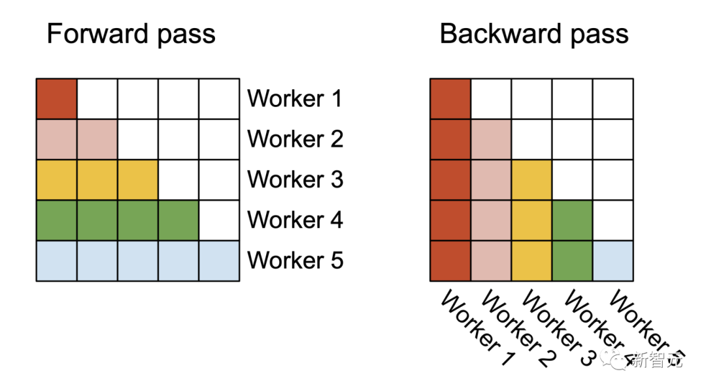

> 在前向处理（左图）中，研究者将Worker（线程块）并行化，每个Worker负责处理注意力矩阵的一个行块。在后向处理过程中（右图），每个Worker处理注意力矩阵的一个列块

每个线程块都在流式多处理器 （SM）运行，例如，A100 GPU上有108个这样的处理器。当这个数字很大（比如 ≥80）时，这种调度是有效的，因为在这种情况下，可以有效地使用GPU上几乎所有的计算资源。

在长序列的情况下（通常意味着更小批或更少的头），为了更好地利用GPU上的多处理器，研究人员在序列长度的维度上另外进行了并行化，使得该机制获得了显著加速。

**更好的工作分区**

即使在每个线程块内，研究人员也必须决定如何在不同的warp（线程束）之间划分工作（一组32个线程一起工作）。研究人员通常在每个线程块使用4或8个warp，分区方案如下图所示。

研究人员在FlashAttention-2中改进了这种分区，减少了不同warp之间的同步和通信量，从而减少共享内存读/写。

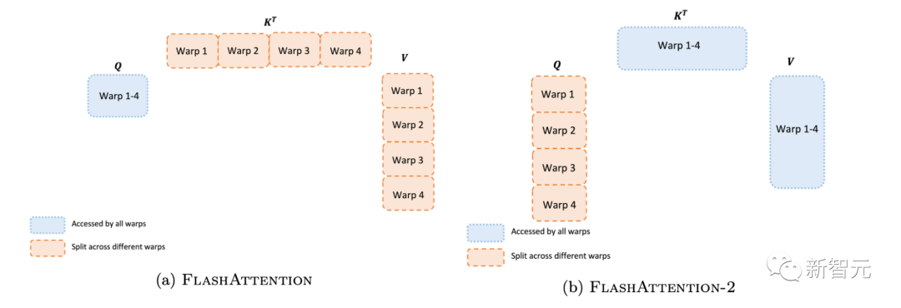

对于每个块，FlashAttention将K和V分割到4个warp上，同时保持Q可被所有warp访问。这称为「sliced-K」方案。

然而，这样做的效率并不高，因为所有warp都需要将其中间结果写入共享内存，进行同步，然后再将中间结果相加。

而这些共享内存读/写会减慢FlashAttention中的前向传播速度。

在FlashAttention-2中，研究人员将Q拆分为4个warp，同时保持所有warp都可以访问K和V。

在每个warp执行矩阵乘法得到Q K^T的一个切片后，它们只需与共享的V切片相乘，即可得到相应的输出切片。

这样一来，warp之间就不再需要通信。共享内存读写的减少就可以提高速度。

### **新功能：头的维度高达256，多查询注意力**

FlashAttention仅支持最大128的头的维度，虽说适用于大多数模型，但还是有一些模型被排除在外。

FlashAttention-2现在支持256的头的维度，这意味着GPT-J、CodeGen、CodeGen2以及Stable Diffusion 1.x等模型都可以使用FlashAttention-2来获得加速和节省内存。

v2还支持多查询注意力（MQA）以及分组查询注意力（GQA）。

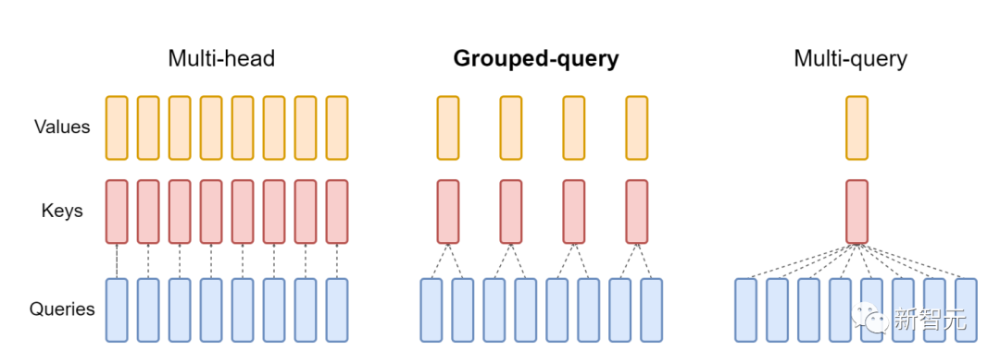

> GQA为每组查询头共享单个key和value的头，在多头和多查询注意之间进行插值

这些都是注意力的变体，其中多个查询头会指向key和value的同一个头，以减少推理过程中KV缓存的大小，并可以显著提高推理的吞吐量。

### **注意力基准**

研究人员人员在A100 80GB SXM4 GPU 上测量不同设置（有无因果掩码、头的维度是64或128）下不同注意力方法的运行时间。

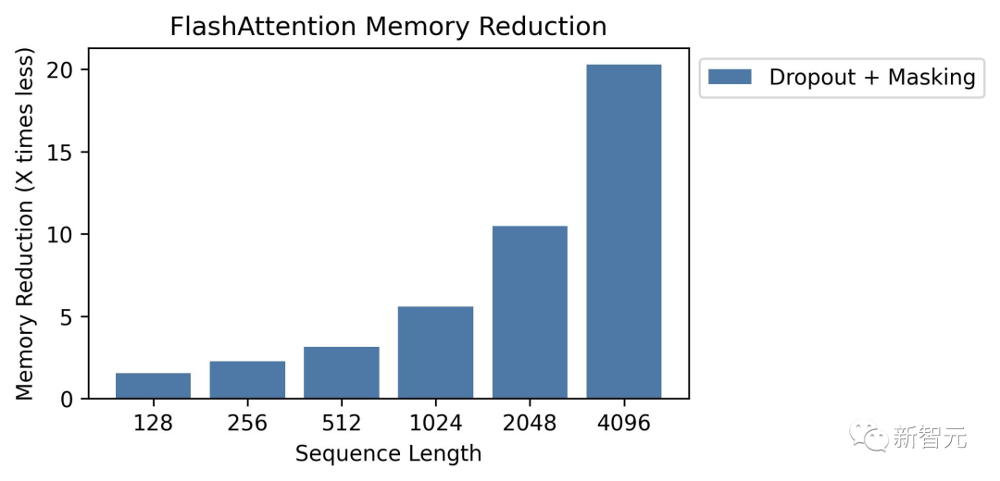

研究人员发现FlashAttention-2比第一代快大约2倍（包括在xformers库和Triton中的其他实现）。

与PyTorch中的标准注意力实现相比，FlashAttention-2的速度最高可达其9倍。

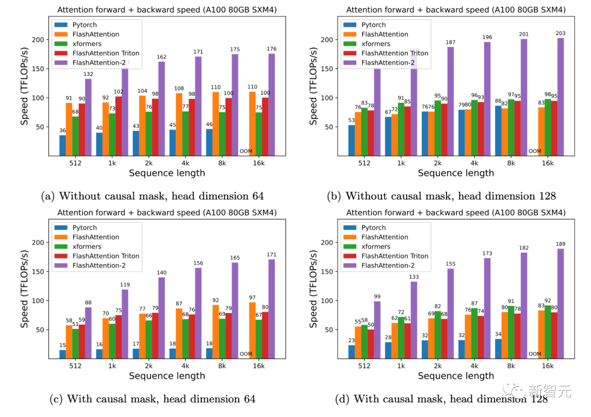

A100 GPU上的前向+后向速度

只需在H100 GPU上运行相同的实现（不需要使用特殊指令来利用TMA和第四代Tensor Core等新硬件功能），研究人员就可以获得高达335 TFLOPs/s的速度。

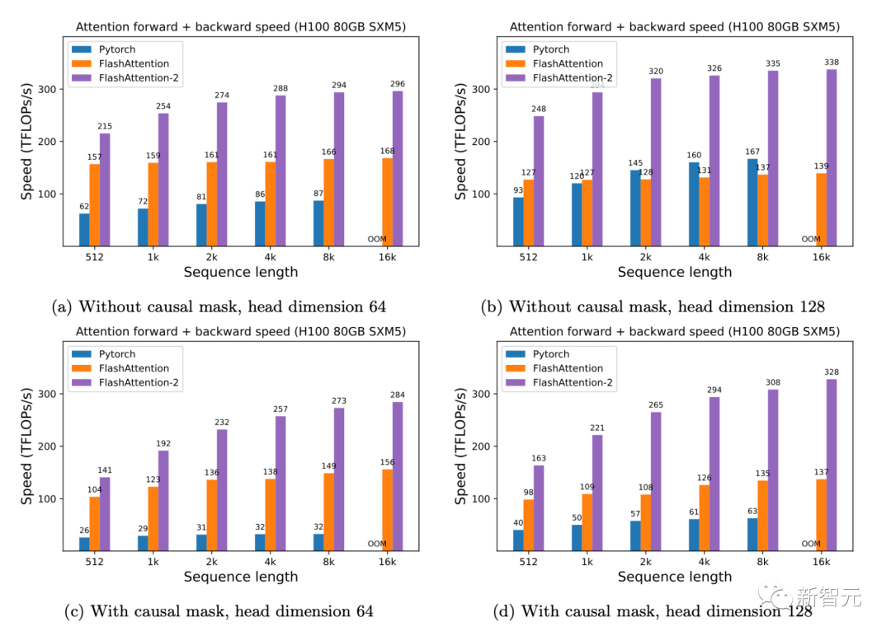

> H100 GPU上的前向+后向速度

当用于端到端训练GPT类模型时，FlashAttention-2能在A100 GPU上实现高达225TFLOPs/s的速度（模型FLOPs利用率为72%）。

与已经非常优化的FlashAttention模型相比，端到端的加速进一步提高了1.3倍。

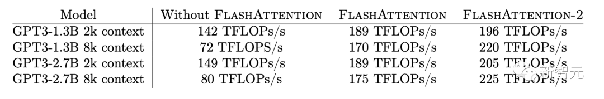

### **未来的工作**

速度上快2倍，意味着研究人员可以用与之前训练8k上下文模型相同的成本，来训练16k上下文长度的模型。这些模型可以理解长篇书籍和报告、高分辨率图像、音频和视频。

同时，FlashAttention-2还将加速现有模型的训练、微调和推理。

在不久的将来，研究人员还计划扩大合作，使FlashAttention广泛适用于不同类型的设备（例如H100 GPU、AMD GPU）以及新的数据类型（例如fp8）。

下一步，研究人员计划针对H100 GPU进一步优化FlashAttention-2，以使用新的硬件功能（TMA、第四代Tensor Core、fp8等等）。

将FlashAttention-2中的低级优化与高级算法更改（例如局部、扩张、块稀疏注意力）相结合，可以让研究人员用更长的上下文来训练AI模型。

研究人员也很高兴与编译器研究人员合作，使这些优化技术更好地应用于编程。