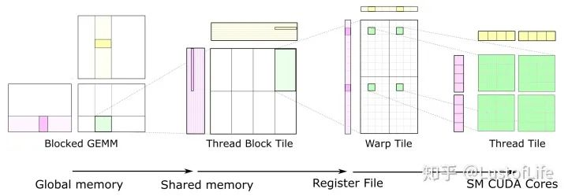

https://numba.readthedocs.io/en/stable/cuda/

https://blog.csdn.net/qq_33431368/article/details/128107637



# 书写CUDA内核 - Writing CUDA Kernels

## 内核声明- Kernel declaration

```python
@cuda.jit
def increment_by_one(an_array):
    """
    Increment all array elements by one.
    """
    # code elided here; read further for different implementations
```

### 内核调用- Kernel invocation

```python
threadsperblock = 32
blockspergrid = (an_array.size + (threadsperblock - 1)) // threadsperblock
increment_by_one[blockspergrid, threadsperblock](an_array)
```

- 通过指定块数（**threadsperblock**）和每个块的线程数（**blockspergrid**）来实例化内核本身。

- **运行内核，即函数（**increment_by_one**）将输入数组传递给它。**

- 使用cuda.synchronize()来等待前面的内核完成计算过程
> 备注：块的大小可根据《[CUDA C Programming Guide](http://docs.nvidia.com/cuda/cuda-c-programming-guide)》获得。

### 多维块和网格 - Multi-dimensional blocks and grids

为了帮助处理多维数组，**CUDA**允许您指定多维块和网格。在上面的例子中，您可以生成一个、两个或三个整数的**blockspergrid**和**threadsperblock**元组。与同等大小的**1D数组**声明相比，这不会改变生成代码的效率或行为，但可以帮助您以更自然的方式编写算法。

## 线程定位- Thread positioning

当运行内核时，内核函数的代码由每个线程执行一次。因此，它必须知道它在哪个线程中，才能知道它负责哪个数组元素（复杂的算法可能定义更复杂的责任，但基本原理是一样的）。

一种方法是线程确定其在网格和块中的位置，并手动计算相应的数组位置：

```python
@cuda.jit
def increment_by_one(an_array):
    # Thread id in a 1D block
    tx = cuda.threadIdx.x
    # Block id in a 1D grid
    ty = cuda.blockIdx.x
    # Block width, i.e. number of threads per block
    bw = cuda.blockDim.x
    # Compute flattened index inside the array
    pos = tx + ty * bw
    if pos < an_array.size:  # Check array boundaries
        an_array[pos] += 1
```

> 除非您确定块大小和网格大小是数组大小的除数，否则必须如上所示检查边界。

`threadIdx`**、**`blockIdx`**、**`blockDim`**和**`gridDim`**是**CUDA后端提供的特殊对象，其唯一目的是了解线程层次结构的几何结构以及当前线程在该几何结构中的位置。这些对象可以是**1D**、**2D**或**3D**，具体取决于内核的调用方式。要访问每个维度的值，请分别使用这些对象的**x**、**y**和**z**属性。
**参数解释：**

- `numba.cuda.threadIdx`: 当前线程块中的线程索引。对于1D块，索引（由x属性给定）是一个整数，其范围从0（包括0）到`numba.cuda.blockDim`（不包括0）。当使用多个维度时，每个维度都存在类似的规则。

- `numba.cuda.blockDim`: 实例化内核时声明的线程块的形状。这个值对于给定内核中的所有线程都是相同的，即使它们属于不同的块（即每个块都是“满的”）。
- `numba.cuda.blockIdx`: 线程网格中的块索引启动了一个内核。对于1D网格，索引（由x属性给定）是一个整数，其范围从0（包括0）到`numba.cuda.gridDim`（不包括）。当使用多个维度时，每个维度都存在类似的规则。
- `numba.cuda.gridDim`: 实例化内核时声明的块网格的形状，即此内核调用启动的块的总数。

### 绝对定位 - [Absolute positions](https://numba.readthedocs.io/en/stable/cuda/kernels.html#absolute-positions)

简单的算法将倾向于总是以与上面示例中所示相同的方式使用线程索引。Numba提供了额外的设施来实现此类计算的自动化：

- `numba.cuda.grid(ndim)`: 返回当前线程在整个块网格中的绝对位置。ndim应该与实例化内核时声明的维度数相对应。如果ndim为1，则返回一个整数。如果ndim是2或3，则返回给定整数数的元组。

- `numba.cuda.gridsize(ndim)`: 返回整个块网格的绝对大小（或形状）（以线程为单位）。ndim与上面的`grid()`中的含义相同。

下面分别是一维和二维的数组

```
@cuda.jit
def increment_by_one(an_array):
    pos = cuda.grid(1)
    if pos < an_array.size:
        an_array[pos] += 1
```

```
@cuda.jit
def increment_a_2D_array(an_array):
    x, y = cuda.grid(2)
    if x < an_array.shape[0] and y < an_array.shape[1]:
       an_array[x, y] += 1
```

> 请注意，实例化内核时的网格计算仍然必须手动完成，例如：

```
threadsperblock = (16, 16)
blockspergrid_x = math.ceil(an_array.shape[0] / threadsperblock[0])
blockspergrid_y = math.ceil(an_array.shape[1] / threadsperblock[1])
blockspergrid = (blockspergrid_x, blockspergrid_y)
increment_a_2D_array[blockspergrid, threadsperblock](an_array)
```

# 内存管理 - Memory management

## 数据转换 - Data transfer

尽管Numba可以自动将NumPy数组传输到设备，但它只能保守地在内核完成时将设备内存传输回主机。为了避免对只读数组进行不必要的传输，可以使用以下API手动控制传输：

- numba.cuda.device_array(*shape*, *dtype=np.float_*, *strides=None*, *order='C'*, *stream=0*)：分配一个空设备ndarray。类似于numpy.empty()。
- numba.cuda.device_array_like(*ary*, *stream=0*)：使用数组中的信息调用`device_array()`。

- numba.cuda.to_device(*obj*, *stream=0*, *copy=True*, *to=None*): 分配并传输一个numpy ndarray或结构化标量到设备。

```python
ary = np.arange(10)
d_ary = cuda.to_device(ary)
```

```python
stream = cuda.stream()
d_ary = cuda.to_device(ary, stream=stream)  # 未知
```

得到的`d_ary`是一个`DeviceNDarray`对象。

```
# To copy device->host:
hary = d_ary.copy_to_host()

# To copy device->host to an existing array
ary = np.empty(shape=d_ary.shape, dtype=d_ary.dtype)
d_ary.copy_to_host(ary)

# To enqueue the transfer to a stream: 未知
stream = cuda.stream()
hary = d_ary.copy_to_host(stream=stream)
```

后面的暂时不记录了