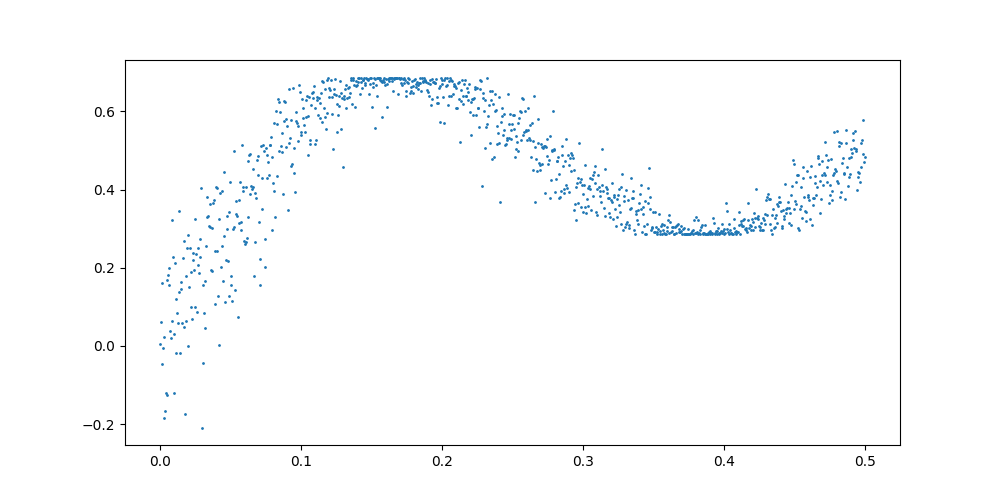
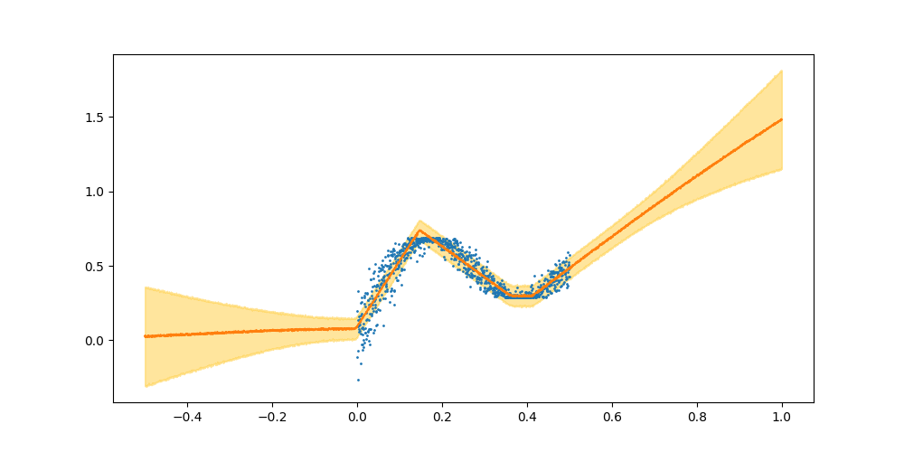

# 关于贝叶斯神经网络（BNN）

> 作者：Dreamstar & YYY
>
> 这个笔记是我目前根据看的资料来整理的简版，主要是我认为有用的链接，你可以以这个为基础进行资料和代码的收集，我们将在周五或随后的时间集中进行讨论。

## 1. 贝叶斯深度学习网络简介及相关资源

贝叶斯深度学习网络模型实际上是将概率统计的思想引入到了深度学习的框架中，但是完备的模型结构会导致参数优化和求解困难，更加的费时，因此有一些简化的版本，我们目前的所针对的是一种MCdropout的近似贝叶斯估计，其优点是只要原模型中的含有dropout的成分，就可以的使用，并且，对训练的速度没有太太的影响。

下面列举一些还算可以的资源：

### 文献资源

> 文章就尽量聚焦，我这里只放最重要的那个文献和我认为有用的文献。

1. [Dropout as a Bayesian Approximation: Representing Model Uncertainty in Deep Learning](https://arxiv.org/abs/1506.02142)：重点参考的文献，是这个文献提出的基于Dropout的贝叶斯概率估计技术。==在paper with code中可以看到一些基于这个文章实现的代码==
2. [Dropout as a Bayesian Approximation: Appendix](https://arxiv.org/abs/1506.02157)：它还有一个附录。
3. [Well logging prediction and uncertainty analysis based on recurrent neural network with attention mechanism and Bayesian theory](https://www.sciencedirect.com/science/article/pii/S0920410521011013)：这个文章是基于不确定分析的一种应用形式，可以直观的看到预测之后所需要达到的效果。

### 视频资源

1. [神经网络（十三）：贝叶斯神经网络](https://www.bilibili.com/video/BV1TL4y187qF/?spm_id_from=333.999.0.0&vd_source=3aa88642179030efe4ce362bda4fea11)：这个视频算是一种科普的性质，也是B站为数不多的关于BNN介绍的视频，建议优先观看，建立一个概念。
2. [Andrew Rowan - 爱德华的贝叶斯深度学习（以及使用Dropout的技巧）（英文字幕）](https://www.bilibili.com/video/BV1G4411U71e/?spm_id_from=333.999.0.0&vd_source=3aa88642179030efe4ce362bda4fea11)：这个是一个英文的视频，主要是部分理论和工具的介绍，我主要还是关注pytorch的实现，因此这个视频一般，主要参考视频中出现的一些文章。

### 博客资源

> 目前实际上还没有找到一个特别好的博客资源

1. [[贝叶斯深度学习] 2 Bayesian深度学习理论与应用：两篇经典之作](https://zhuanlan.zhihu.com/p/363970396)：可以快速阅读一下，不必花太多的时间和心思。

### 相关代码和库

> 建议这里先自己尝试找一下，最后再看是否有重合，避免影响思路。

1. [pyro](http://pyro.ai/examples/bayesian_regression.html)：第三方库及官网教程；
2. [github - uncertainty-deep-learning](https://github.com/cpark321/uncertainty-deep-learning)：
3. [github - torch-uncertainty](https://github.com/ENSTA-U2IS-AI/torch-uncertainty)：

## 2. 贝叶斯神经网络理论

> 略， 时间因素，不能在这里花太长的时间

### MC dropout

目前已知的目标是复现mcdropout的贝叶斯概率分布估计，深度神经网络中的dropout被认为是一个高斯过程，可以使用变分推断进行概率估计。

## 3. 代码测试及优缺点

### pyro - 第三方库

> 来源：代码以kaggle的代码为起点，讲述贝叶斯网络的实现过程。

#### (1) Simple Bayesian Neural Network in Pyro.py

这是一个相对标准且简单的贝叶斯神经网络的训练和预测部分，实现了最简单的四层神经网络结构，含有两个隐藏层，层之间的权重和偏置以均值为0方差为1的高斯分布所控制。

- 训练过程：使用adam作为优化器，损失函数是Trace_ELBO()，还使用了变分推断，总之和常规的神经网络训练过程有一定的区别。
- 预测过程：预测过程生成一组x数据（维度为3000长度的向量），来预测，得到pred，pred是一个字典的形式，储存了神经网络结构中的参数、sigma以及观测值obs。观测值obs是重点，是一个维度为500*3000的tensor表明了一个x对应了500个预测结果，由此就可以计算均值和方差，从而形成我们所需要的绘图。

训练数据为一函数形式，数据分布如下：



经过训练后，数据预测的概率分布如下：



**小结**：标准的贝叶斯网络的结构中并没有dropout，在网络的初始化时，参数遵循（0,1）正态分布。训练前需要使用`AutoDiagonalNormal()`引导函数，在训练过程中，使用`SVI`变分推断，结合`ELBO`loss函数。 预测过程将x的所有取值简单罗列并计算所有可能性（这在特征单一的时候可行），然后通过观测值在不同x取值时的均值和方差来绘制概率分布。

#### (2) Bayesian Regression.py

这个案例是的对上面简单模型的补充和递进，与之前不同的是，这里在对预测结果的处理中略显不同，

- `guide.quantiles([0.25, 0.5, 0.75])`使用了这种具有计算分位数的方式；

- 在对预测结果的分析中，使用summary来总结均值、方差、分位数。

  ```
  def summary(samples):
      site_stats = {}
      for k, v in samples.items():
          site_stats[k] = {
              "mean": torch.mean(v, 0),
              "std": torch.std(v, 0),
              "5%": v.kthvalue(int(len(v) * 0.05), dim=0)[0],
              "95%": v.kthvalue(int(len(v) * 0.95), dim=0)[0],
          }
      return site_stats
  ```

- 