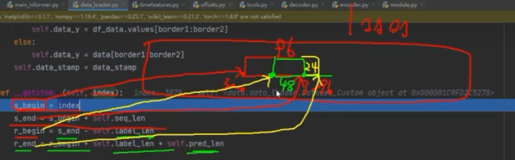

# Informer: Beyond Efficient Transformer for Long Sequence Time-Series Forecasting (AAAI'21 Best Paper)

## 源码中的参数

shuffle_flag： datasets在分batchsize的时候是否打乱。

drop_last： 分batchsize的时候是否丢弃多余数据。

seq_len： 输入序列长度。默认96

label_len：标签长度，decoder中预热数据的长度，默认48

pred_len： 预测长度，decoder中实际预测的数据数量，默认24，与label_len相加为72

features： 特征数据，即输入的数据（包含了很多列）

target：标签列，目标预测列

scale:  控制是否进行标准化操作

inverse：

s_begin：

s_end：

r_begin：

r_end：

seq_x_mark：输入序列中经过pandas处理的时间特征。

seq_y_mark：输出序列中经过pandas处理的时间特征。

