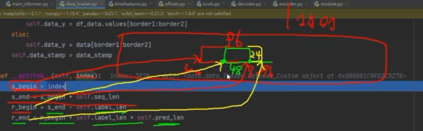

# Informer: Beyond Efficient Transformer for Long Sequence Time-Series Forecasting (AAAI'21 Best Paper)

## 源码中的参数

shuffle_flag： datasets在分batchsize的时候是否打乱。

drop_last： 分batchsize的时候是否丢弃多余数据。

seq_len： 输入序列长度。96

label_len：标签长度，decoder中的先准备一些数据预热，48

pred_len： 预测长度，decoder中实际预测的数据数量，24，和label_len相加为72

features： 特种数据，可以认为是输入的数据（包含了很多列）

target：标签列，目标预测列

scale:  控制是否进行标准化操作

s_begin

s_end

r_begin

r_end

seq_x_mark：输入序列中经过pandas处理的时间特征。

seq_y_mark：输出序列中经过pandas处理的时间特征。

