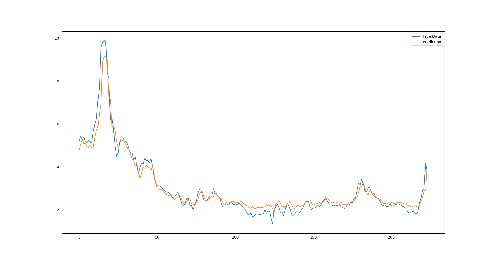

# 可解释时间序列分析的多级小波分解网络 - Multilevel Wavelet Decomposition Network (Pytorch)

这个项目框架从以下几个链接中获取资源并进行了改造，用于对这个模型的测试和分析，因为这个论文并没有提供作者官方的源码版本。

- [CSDN-博客翻译](https://blog.csdn.net/qq_33431368/article/details/130716694?spm=1001.2014.3001.5501)
- [paper with code](https://paperswithcode.com/paper/multilevel-wavelet-decomposition-network-for)
- [github代码-tsai](https://github.com/timeseriesAI/tsai/blob/main/tsai/models/mWDN.py)
- [github代码- yakouyang](https://github.com/yakouyang/Multilevel_Wavelet_Decomposition_Network_Pytorch) - 项目框架来源于这里，因为这里有一整套的内容。

This project is the **pytorch** implementation version of Multilevel Wavelet Decomposition Network. 
[https://arxiv.org/abs/1806.08946](https://arxiv.org/abs/1806.08946)    
And the code is a simple implementation of the prediction task part(mLSTM) of the paper.

## Description

- The code simply implements twice wavelet decompositions,which can be further similarly expanded.
- The optimization part omits the use of mWDN for pre-training in the original paper.

## Requirements
- pytorch == 0.4.0
- python == 3.6

## Test Result Display
- Wavelet_LSTM : sequence_length=12, predict step=1 ,epochs=20,batch_size=32    

