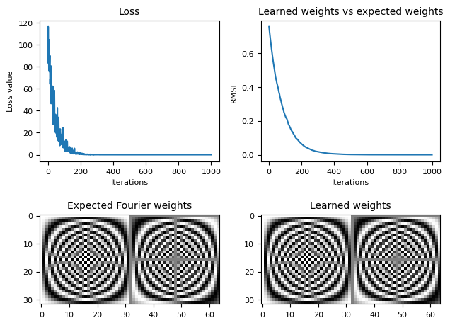
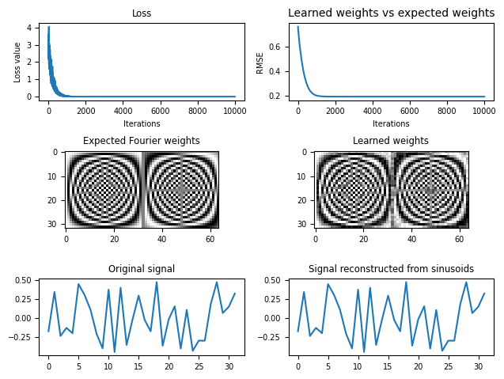
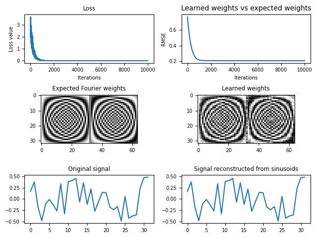

# 傅里叶变换

## [使用神经网络学习傅里叶变换](https://mp.weixin.qq.com/s/R9yP_-4cR01b2Oi6UNgPpA)

参考链接：  
[1] [微信-你还弄不懂的傅里叶变换，神经网络只用了30多行代码就学会了](https://mp.weixin.qq.com/s/R9yP_-4cR01b2Oi6UNgPpA)  
[2] [网页-The Fourier transform is a neural network](https://sidsite.com/posts/fourier-nets/#amplitude-and-phase-reconstruction-nonlinearities)  

> **离散傅里叶变换(DFT)就是把一串复杂波形中分成不同频率成分**，通过傅里叶变换，就能把杂乱的声波转化为正弦波，得到频谱图。

如果把声波视作一个连续函数，它可以唯一表示为一堆三角函数相叠加。不过在叠加过程中，每个三角函数的加权系数不同，有的要加高一些、有的要压低一些，有的甚至不加。傅里叶变换要找到这些三角函数以及它们各自的权重。**这个寻找权重的过程，就和神经网络很相似**，因为神经网络本质上就是逼近一个函数。

首先要把离散傅里叶变换(DFT)**看作是一个人工神经网络**，这是一个单层网络，没有bias、没有激活函数，并且对于权重有特定的值。它输出节点的数量等于傅里叶变换计算后频率的数量。

$y_k = \displaystyle \sum_{n=0}^{N-1} x_n \cdot \exp(-i\frac{2 \pi k}{N}n) \tag{1}$

- **k**表示每N个样本的循环次数；
- **N**表示信号的长度；
- $x_n$表示信号在样本$n$处的值

> 一个信号可以表示为所有正弦信号的和。$y_k$是一个复值，它给出了信号$x$中频率为$k$的正弦信号的信息；从$y_k$我们可以计算正弦的振幅和相位。公式(1)以矩阵式表示如下：

$$y_k = [x_0, x_1,... x_{N-1}]
\begin{bmatrix}
    \exp(0)\\
    \exp(-i\frac{2 \pi k}{N})\\
    \exp(-i\frac{2 \pi k}{N}2)\\
    \exp(-i\frac{2 \pi k}{N}3)\\
    \exp(-i\frac{2 \pi k}{N}4)\\
    \vdots \\
    \exp(-i\frac{2 \pi k}{N}(N-1))
\end{bmatrix}$$

上述公式是特定值$k$的傅里叶值。通常要计算全频谱，即$k$从$[0,1,...,N-1]$的值，用矩阵形式表示($k$按列递增，$n$按行递增)：

$$[y_0... y_{N-1}] = [x_0... x_{N-1}]
\begin{bmatrix}
    \exp(0)     & \exp(0)                     & \exp(0)                      & \dots  & \exp(0) \\
    \exp(0)     & \exp(-i\frac{2\pi}{N})      & \exp(-i\frac{2\pi2}{N})      & \dots  & \exp(-i\frac{2\pi(N-1)}{N}) \\
    \exp(0)     & \exp(-i\frac{2\pi}{N}2)     & \exp(-i\frac{2\pi2}{N}2)     & \dots  & \exp(-i\frac{2\pi(N-1)}{N}2)\\ 
    \exp(0)     & \exp(-i\frac{2\pi}{N}3)     & \exp(-i\frac{2\pi2}{N}3)     & \dots  & \exp(-i\frac{2\pi(N-1)}{N}3)\\ 
    \vdots      & \vdots                      & \vdots                       &        & \vdots \\
    \exp(0)     & \exp(-i\frac{2\pi}{N}(N-1)) & \exp(-i\frac{2\pi2}{N}(N-1)) & \dots  & \exp(-i\frac{2\pi(N-1)}{N}(N-1))
\end{bmatrix}$$


简化表示如下：

$$\boldsymbol{y} = \boldsymbol{x} W_{Complex Fourier} \tag{2}$$

> 这种形式是一个没有bias和激活函数的神经网络层，其中指数矩阵包含权值，可以称之为**仿复合傅里叶权值(Complex Fourier weights)**，通常情况下我们无法提前知道神经网络中的权重，但下面我们假设可以提前知道。

### 替换复数

神经网络中通常不使用复数，因此需要进行替换，将矩阵翻倍，左边一半为实数形式，右边一半为复数形式。即$e^{-i\theta} = cos(\theta) - i sin(\theta)$，将$\theta=\frac{2\pi k}{N}n$代入DFT，即式(1)中，可得：

$$exp(-i \frac{2\pi k} {N}n)=cos(\frac{2\pi k} {N}n)-isin(\frac{2\pi k} {N}n)$$

然后使用cos形式表示实部，置于矩阵的左半部分，用sin形式表示虚部，置于矩阵的右半部分：

$$\hat{\boldsymbol{y}} = [x_0 ... x_{N-1}]
\begin{bmatrix}
    \cos(0)     & \cos(0)                   & \dots  & \cos(0) & -\sin(0) & -\sin(0) & \dots & -\sin(0)\\
    \cos(0)     & \cos(\frac{2\pi}{N})      & \dots  & \cos(\frac{2\pi(N-1)}{N}) & -\sin(0)     & -\sin(\frac{2\pi}{N})      & \dots & -\sin(\frac{2\pi(N-1)}{N})\\
    \cos(0)     & \cos(\frac{2\pi}{N}2)     & \dots  & \cos(\frac{2\pi(N-1)}{N}2) & -\sin(0)     & -\sin(\frac{2\pi}{N}2)     & \dots & -\sin(\frac{2\pi(N-1)}{N}2)\\
    \cos(0)     & \cos(\frac{2\pi}{N}3)     & \dots  & \cos(\frac{2\pi(N-1)}{N}3) & -\sin(0)     & -\sin(\frac{2\pi}{N}3)     & \dots & -\sin(\frac{2\pi(N-1)}{N}3)\\ 
    \vdots      & \vdots                    &        & \vdots & \vdots  & \vdots                      &       & \vdots\\
    \cos(0)     & \cos(\frac{2\pi}{N}(N-1)) & \dots  & \cos(\frac{2\pi(N-1)}{N}(N-1)) & -\sin(0)     & -\sin(\frac{2\pi}{N}(N-1)) & \dots & -\sin(\frac{2\pi(N-1)}{N}(N-1))
\end{bmatrix}$$

公式可简化表示为：

$$\hat{\boldsymbol{y}} = \boldsymbol{x} W_{Fourier} \tag{3}$$

其中$W_{Fourier}$称为**傅里叶权重**。

> $\hat y$和$y$实际上包含相同的信息，但是$\hat y$不适用复数形式，因此长度是$y$的两倍。
>
> 换句话说，我们可以用$W_{Fourier}$或$$W_{ComplexFourier}$$表示振幅和相位，但是通常会使用$W_{Fourier}$

### 使用傅里叶权重计算傅里叶变换

用神经网络来实现$\hat y=xW_{Fourier}$，并用快速傅里叶变换(FFT)检查有效性。

```python
import numpy as np

def create_fourier_weights(signal_length):  
    "Create weights, as described above."
    k_vals, n_vals = np.mgrid[0:signal_length, 0:signal_length]
    theta_vals = 2 * np.pi * k_vals * n_vals / signal_length
    return np.hstack([np.cos(theta_vals), -np.sin(theta_vals)])

# Generate data:
signal_length = 64
x = np.random.random(size=[1, signal_length]) - 0.5

# Compute Fourier transform using method described above:
W_fourier = create_fourier_weights(signal_length)
y = np.matmul(x, W_fourier)

# Compute Fourier transform using the fast Fourier transform: 
fft = np.fft.fft(x)
y_fft = np.hstack([fft.real, fft.imag])

# Compare the results:
print('rmse: ', np.sqrt(np.mean((y - y_fft)**2)))
```

```
rmse:  1.5429611622665193e-14
```

极小的误差证实了我们的计算是正确的。

另一种检查的方法是重构信号：

```python
import matplotlib.pyplot as plt

y_real = y[:, :signal_length]
y_imag = y[:, signal_length:]
tvals = np.arange(signal_length).reshape([-1, 1])
freqs = np.arange(signal_length).reshape([1, -1])
arg_vals = 2 * np.pi * tvals * freqs / signal_length
sinusoids = (y_real * np.cos(arg_vals) - y_imag * np.sin(arg_vals)) / signal_length
reconstructed_signal = np.sum(sinusoids, axis=1)

print('rmse:', np.sqrt(np.mean((x - reconstructed_signal)**2)))
plt.subplot(2, 1, 1)
plt.plot(x[0,:])
plt.title('Original signal')
plt.subplot(2, 1, 2)
plt.plot(reconstructed_signal)
plt.title('Signal reconstructed from sinusoids after DFT')
plt.tight_layout()
plt.show()
```

```
rmse: 2.3243522568191728e-15
```


### 通过梯度下降来学习傅里叶变换

我们不需要提前计算权重，和之前一样，我们可以学习他们。(注意：[这里](https://sidsite.com/posts/fourier-nets/#amplitude-and-phase-reconstruction-nonlinearities)的例子更加的有趣，因为被优化的系统是非线性的.)。首先，与[endolith (see GitHub Gist)](https://gist.github.com/endolith/98863221204541bf017b6cae71cb0a89)相似，我将会使用快速傅里叶变换(FFT)来训练一个网络来执行离散傅里叶变换(DFT)：

```python
# -*- coding: utf-8 -*-
# @Time    : 2022/12/29 15:47
# @Author  : Dreamstar
# @File    : 3.learn_fourier_transform_via_gradient_descent.py
# @Desc    : 使用快速傅里叶变换FFT来训练一个神经网络来执行离散傅里叶变换DFT

import matplotlib.pyplot as plt
import numpy as np
from tqdm import tqdm


def create_fourier_weights(signal_length):
    "Create weights, as described above."
    k_vals, n_vals = np.mgrid[0:signal_length, 0:signal_length]
    theta_vals = 2 * np.pi * k_vals * n_vals / signal_length
    return np.hstack([np.cos(theta_vals), -np.sin(theta_vals)])


import tensorflow as tf

signal_length = 32

# Initialise weight vector to train:
W_learned = tf.Variable(np.random.random([signal_length, 2 * signal_length]) - 0.5)

# Expected weights, for comparison:
W_expected = create_fourier_weights(signal_length)

losses = []
rmses = []

for i in tqdm(range(1000)):
    # Generate a random signal each iteration:
    x = np.random.random([1, signal_length]) - 0.5

    # Compute the expected result using the FFT:
    fft = np.fft.fft(x)
    y_true = np.hstack([fft.real, fft.imag])

    with tf.GradientTape() as tape:
        y_pred = tf.matmul(x, W_learned)
        loss = tf.reduce_sum(tf.square(y_pred - y_true))

    # Train weights, via gradient descent:
    W_gradient = tape.gradient(loss, W_learned)
    W_learned = tf.Variable(W_learned - 0.1 * W_gradient)

    losses.append(loss)
    rmses.append(np.sqrt(np.mean((W_learned - W_expected) ** 2)))

loss = np.average(losses)
rmse = np.average(rmses)
print(f'Final loss value:{loss}')
print(f"Final weights' rmse value:{rmse}")
```

```
Final loss value:4.105579559237755
Final weights' rmse value:0.062438434819039886
```

```python
plt.rcParams.update({'font.size':8})  # 全局设置
plt.subplot(2, 2, 1)
plt.plot(losses)
plt.title('Loss', fontsize=10)
plt.xlabel('Iterations', fontsize=8)
plt.ylabel('Loss value', fontsize=8)
plt.xticks(fontsize=8)  # 设置标签
plt.yticks(fontsize=8)
plt.subplot(2, 2, 2)
plt.plot(rmses)
plt.title('Learned weights vs expected weights', fontsize=10)
plt.xlabel('Iterations', fontsize=8)
plt.ylabel('RMSE', fontsize=8)
plt.subplot(2, 2, 3)
plt.imshow(W_expected, vmin=-1, vmax=1, cmap='gray')
plt.title('Expected Fourier weights', fontsize=10)
plt.subplot(2, 2, 4)
plt.imshow(W_learned, vmin=-1, vmax=1, cmap='gray')
plt.title('Learned weights', fontsize=10)
plt.tight_layout()
plt.show()
```



### 通过重构学习傅里叶变换

我们在前面使用了快速傅里叶变换(FFT)，为了使神经网络学习并表示傅里叶变换。接下来通过训练网络来重构输入数据来学习离散傅里叶变换(DFT)。

```python
from tqdm import tqdm
W_learned = tf.Variable(np.random.random([signal_length, 2 * signal_length]) - 0.5)

tvals = np.arange(signal_length).reshape([-1, 1])
freqs = np.arange(signal_length).reshape([1, -1])
arg_vals = 2 * np.pi * tvals * freqs / signal_length
cos_vals = tf.cos(arg_vals) / signal_length
sin_vals = tf.sin(arg_vals) / signal_length

losses = []
rmses = []

for i in tqdm(range(10000)):
    x = np.random.random([1, signal_length]) - 0.5
    
    with tf.GradientTape() as tape:
        y_pred = tf.matmul(x, W_learned)
        y_real = y_pred[:, 0:signal_length]
        y_imag = y_pred[:, signal_length:]
        sinusoids = y_real * cos_vals - y_imag * sin_vals
        reconstructed_signal = tf.reduce_sum(sinusoids, axis=1)
        loss = tf.reduce_sum(tf.square(x - reconstructed_signal))

    W_gradient = tape.gradient(loss, W_learned)    
    W_learned = tf.Variable(W_learned - 0.5 * W_gradient)

    losses.append(loss)
    rmses.append(np.sqrt(np.mean((W_learned - W_expected)**2)))
loss = np.average(losses)
rmse = np.average(rmses)
print(f'Final loss value:{loss}')
print(f"Final weights' rmse value:{rmses}")
```

```
Final loss value:0.05881874172861317
Final weights' rmse value:0.21067086212332414
```

```python
plt.rcParams.update({'font.size': 8})  # 全局设置
plt.subplot(3, 2, 1)
plt.plot(losses)
plt.title('Loss', fontsize=10)
plt.xlabel('Iterations', fontsize=8)
plt.ylabel('Loss value', fontsize=8)
plt.xticks(fontsize=8)  # 设置标签
plt.yticks(fontsize=8)
plt.subplot(3, 2, 2)
plt.plot(rmses)
plt.title('Learned weights vs expected weights', fontsize=10)
plt.xlabel('Iterations', fontsize=8)
plt.ylabel('RMSE', fontsize=8)
plt.subplot(3, 2, 3)
plt.imshow(W_expected, vmin=-1, vmax=1, cmap='gray')
plt.title('Expected Fourier weights', fontsize=10)
plt.subplot(3, 2, 4)
plt.imshow(W_learned, vmin=-1, vmax=1, cmap='gray')
plt.title('Learned weights', fontsize=10)
plt.subplot(3, 2, 5)
plt.plot(x[0,:])
plt.title('Original signal')
plt.subplot(3, 2, 6)
plt.plot(reconstructed_signal)
plt.title('Signal reconstructed from sinusoids')
plt.tight_layout()
plt.show()
```



> 我们几乎学会了傅里叶变换。学习的权重没有像上面的例子中那样接近傅立叶权重，但是重建的信号是完美的。

### 振幅和相位的重构(非线性)

现在让我们使用正弦曲线(sinusoids)来计算振幅和相位，并使用它们来重构信号。这一次，权重与相关的梯度损失必须经过非线性（幸运的是，这是可微的），因为我们没有将系统简化为线性形式。

```python
W_learned = tf.Variable(np.random.random([signal_length, 2 * signal_length]) - 0.5)

losses = []
rmses = []

for i in tqdm(range(10000)):
    x = np.random.random([1, signal_length]) - .5
    
    with tf.GradientTape() as tape:
        y_pred = tf.matmul(x, W_learned)
        y_real = y_pred[:, 0:signal_length]
        y_imag = y_pred[:, signal_length:]
        amplitudes = tf.sqrt(y_real**2 + y_imag**2) / signal_length
        phases = tf.atan2(y_imag, y_real)
        sinusoids = amplitudes * tf.cos(arg_vals + phases)
        reconstructed_signal = tf.reduce_sum(sinusoids, axis=1)
        loss = tf.reduce_sum(tf.square(x - reconstructed_signal))

    W_gradient = tape.gradient(loss, W_learned)
    W_learned = tf.Variable(W_learned - 0.5 * W_gradient)

    losses.append(loss)
    rmses.append(np.sqrt(np.mean((W_learned - W_expected)**2)))
    
loss = np.average(losses)
rmse = np.average(rmses)
print(f'Final loss value:{loss}')
print(f"Final weights' rmse value:{rmse}")
```

```
Final loss value:0.05818913527618594
Final weights' rmse value:0.22252843817803747
```

```python
plt.rcParams.update({'font.size': 7})  # 全局设置
plt.subplot(3, 2, 1)
plt.plot(losses)
plt.title('Loss')
plt.xlabel('Iterations')
plt.ylabel('Loss value')
# plt.xticks(fontsize=8)  # 设置标签
# plt.yticks(fontsize=8)
plt.subplot(3, 2, 2)
plt.plot(rmses)
plt.title('Learned weights vs expected weights', fontsize=10)
plt.xlabel('Iterations')
plt.ylabel('RMSE')
plt.subplot(3, 2, 3)
plt.imshow(W_expected, vmin=-1, vmax=1, cmap='gray')
plt.title('Expected Fourier weights')
plt.subplot(3, 2, 4)
plt.imshow(W_learned, vmin=-1, vmax=1, cmap='gray')
plt.title('Learned weights')
plt.subplot(3, 2, 5)
plt.plot(x[0,:])
plt.title('Original signal')
plt.subplot(3, 2, 6)
plt.plot(reconstructed_signal)
plt.title('Signal reconstructed from sinusoids')
plt.tight_layout()
plt.show()
```



我们再次得到完美的重构结果，因此振幅和相位一定是准确的。和以前一样，学到的权重与傅里叶权重并不完全相同（但**非常接近**）。所以我们可以推测，导致傅里叶变换的权重有一定的灵活性，而梯度下降将我们带到一个**局部最优**。

------

这个方法还存在以下疑问：

- 如何解释计算出的权值与真正傅里叶权值的差距？
- 傅里叶层放到模型中会带来哪些益处？

------


我们可以将任何线性映射（包括DFT）写成一个没有偏差、没有激活函数和特定权重值的人工神经网络。这是因为线性映射和线性神经网络层都可以写成矩阵乘法。

我们可以把这一点做得更进一步，并认为所有种类的东西都是神经网络（这是一个有趣的练习）。但实际上，在大多数情况下，具有非线性（即激活函数）和多层是必不可少的。

